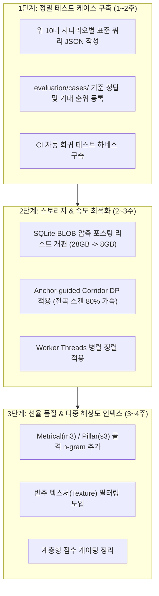

# MUSICANOTE 검색 성능 향상 방향 및 검증 테스트 케이스 10선

**문서 작성일**: 2026-09-05  
**상태**: 2026-09-05 구현 대조 검토 완료 · 아래 제안은 채택/실험/보류를 구분하여 진행  
**대상 코퍼스 규모**: 95,625 Works / 384,425 Melody Streams (SQLite DB 약 28.4GB)

---

## 구현 검토 결정 (2026-09-05)

다음 표가 원안의 확정적인 성능 수치와 일괄 적용 주장보다 우선한다. 프레이즈 모듈은 국소 경계 evidence이지 완전한 셴커/화성 분석이 아니다.

| 제안 | 결정 | 적용 조건/진행 범위 |
|---|---|---|
| 테스트 10종, 생산 검색 A/B Harness | 채택 | 기존 Query 정본·스키마·JSONL export를 보완하고 코드/DB/Query 식별 정보, 정답 미확정, 순위·마디·실제 대상 음표를 기록한다. 유형만으로 Top5나 점수 구간을 정답으로 고정하지 않는다. |
| LBDM 계열 국소 경계 | 수정 채택 | 최초 단계는 상대 IOI·쉼표·국소 변화·제한적 반복 근거의 최종 ±3점 보조 재순위화. Query 양끝을 프레이즈 경계로 단정하거나 프레이즈 중간 Query를 감점하지 않는다. |
| m3/s3 별도 인덱스 | 실험 대기 | 실제 박자 변화, 타이 최초 어택, 원본 note provenance가 전제다. 임계값만으로 뽑은 강박/기둥음 gram을 확정 셴커 분석으로 부르지 않으며 연속 선율 및 보조음 생략의 정당성을 재검증한다. |
| 반주 텍스처 | 수정 후 실험 | 엔트로피·방향전환·빠른 음가 하나로 role을 크게 낮추지 않는다. 반복 밀도·실제 음가·화성/선율 역할과 정답/오탐 쌍을 함께 확인한다. 명시적으로 반주 음형을 검색하면 실제 반주 일치는 유효 결과다. |
| 평균 음가 3~4배 게이트 | 단독 적용 보류 | 균일 확대/축소 허용 정책과 충돌한다. 절대 음가 비율만으로 탈락시키지 않고, 전역 scale과 국소 리듬 왜곡을 분리한다. |
| 60/40 점수식·sigmoid 게이트 | 실험 대기 | 현 가중치를 추정 비율로 교체하지 않는다. 후보 회수 실패와 재순위화 문제를 먼저 나눈 뒤 고정 suite와 미사용 작품에서 보정한다. |
| BLOB/VByte postings | 표본 실험부터 | 28→7~10GB, I/O3배는 측정 전 가설이다. 공통 token의 대형 BLOB, work rowid 안정성, 전체 postings 회수, 메모리 상한을 검증하고 새 DB를 별도로 구축한다. 기존 DB는 즉시 교체하지 않는다. |
| Anchor corridor DP | fallback 포함 실험 | anchor가 누락되거나 gap이 band 밖으로 나가면 최적 경로를 잃을 수 있다. band 확대/full-scan fallback 및 정답 경로 비교 없이 재현율100% 보존을 주장하지 않는다. 기존 seed-window 기능도 검증 전 기본 활성화하지 않는다. |
| worker pool | 프로파일 후 실험 | 코어 수 비례 가속을 보장하지 않는다. 메모리 복제·메시지 전달·SQLite 연결·동시 검색 부하를 측정하고 작은 pool부터 검증한다. |

현황 교정: 원안의 "상위160개"는 현재 코드의 여러 후보 집합 합집합을 정확히 표현하지 못한다. 코드에서 실제 평가 수를 profile로 기록한다. 2026-09-05 재확인 여유 공간은 K 28.93GiB / U 44.38GiB이며, 아래의 15GB 미만은 이전 시점의 관측이다. 확보 공간이 늘었다고 28.4GB 전체 DB 복사·교체를 자동 승인한 것은 아니다.

실행 계획: [phrase-context-execution-plan.md](phrase-context-execution-plan.md). 새 모듈 및 A/B 실행의 검증 결과는 해당 문서와 개발 기록에 별도 기록한다.

테스트 해석 교정:

- Case5에서 총1박의 두 8분음표를 같은 총길이의 붓점 리듬으로 바꾸려면 점8분(.75)+16분(.25)을 사용한다. 점4분+8분은 총2박이므로 전역 길이 변화가 함께 섞인다.
- Case8은 반주형 Query 자체를 부정 사례로 삼지 않는다. 서로 다른 선율인데 흔한 반주 패턴/리듬 때문에 높은 점수를 받은 결과를 오탐 쌍으로 지정한다.
- Case10의 이명동음은 melody/exact에서 같은 MIDI 음정이다. 철자에 따른 증2도/단3도 해석은 표기-aware 분석의 별도 테스트이고, 순수 마우스 contour 입력에는 철자 정보가 없다.
- 자동 생성 변형은 실제 사용자 Query나 전문가 정답으로 표시하지 않으며 parentCaseId·변형 요인·생성 출처를 남긴다.

---

## 1. 개요 및 시스템 진단

MUSICANOTE는 초기 8,111곡 규모에서 **PDMX Classical(약 4.9만 곡)** 및 **금영(KYSing, 약 3.8만 곡)** 코퍼스를 통합하면서 총 **95,625개 작품, 384,425개 선율 스트림**으로 급격히 확장되었습니다.

현재 검색 파이프라인(`n-gram 역색인 → 상위 160개 스트림 전곡 Semi-global DP → Rhythm DTW → Metrical/Schenker 재순위화`)은 음악이론적 설명력과 유연성을 입증했으나, 대규모 데이터 환경에서 다음의 병목과 품질 한계가 드러나고 있습니다:

1. **디스크 I/O 및 스토리지 한계**: 현재 DB 크기 28.4GB, K 드라이브 잔여 공간 15GB 미만. n-gram 조회에만 0.6~3.3초 소요 (`docs/performance-stage-3.md`).
2. **초기 후보 추출(Recall) 누락**: 흔한 3-gram의 조회 상한(3,000건) 도달 및 음 1~2개 변경 시 3-gram/5-gram 동시 파괴로 유효 후보가 탈락 (`Q-P1-001`, `Q-P1-003`).
3. **CPU 연산 지연**: 상위 160개 스트림 전체에 대한 $O(N \times M)$ 정렬로 인해 긴 스트림에서 8~22초 소요 (`Q-10/11 Trepak`).
4. **반주 텍스처 오탐**: 빠른 16분음표 아르페지오/분산화음 반주 파트가 고음역·단선율·길이라는 이유로 선율 결과 상위에 오인 노출 (`Carillon, S3`).

---

## 2. 검색 성능 향상 방향

### 2.1 검색 품질 고도화 (Search Quality / Recall & Precision)

#### A. Metrical & Structural 다중 해상도 역색인 (초기 탈락 방지)
* **문제**: 음높이가 1~2개 변형되거나 장식음이 덧붙으면 연속 n-gram(`i3`, `i5`)이 연쇄 파괴되어 정밀 정렬 단계에 진입조차 못 함.
* **해결책**:
  * **표면 선율 gram (`i3`, `i5`)**: 기존 연속 음표 기반.
  * **박절 골격 gram (`m3`)**: `metricWeight ≥ 0.65`(강박/중강박) 음들만 모아 계산한 interval 3-gram.
  * **기둥선 gram (`s3`)**: `structuralWeight ≥ 0.68`(Schenkerian pillar) 음들만 모아 계산한 3-gram.
  * 잔음표가 틀리거나 장식음이 추가되어도 핵심 골격 일치로 초기 후보 풀에 안정적으로 회수.

#### B. 반주 텍스처(Texture) 필터링 및 선율성 지수(Melodic Salience) 강화
* **문제**: 16분음표 분산화음 반주가 주선율을 제치고 1위로 노출되는 현상.
* **해결책**:
  * **방향 전환 빈도(Contour Flip Rate)** 및 **음고 엔트로피(Pitch Entropy)** 도입: 좁은 화음 구성음 사이를 왕복하는 고속 텍스처 감지 시 `role` 대폭 감점.
  * **템포/음가 스케일 게이팅(Tempo-ratio Gating)**: 쿼리의 평균 음가와 후보의 평균 음가가 3~4배 이상 차이 나는 경우(예: 4분음표 노래 ↔ 16분음표 속주 반주) 감점 처리.

#### C. LBDM(Local Boundary Detection Model) 프레이즈 경계 기반 소프트 정렬
* **문제**: 쉼표/지속음에만 의존하는 프레이즈 판정으로 인해 타이 잔음이나 아우프탁트가 걸친 프레이즈 시작점 오정렬 유발.
* **해결책**:
  * 음정 도약, 음가 변화, 쉼표의 국소 피크를 결합한 **LBDM 경계점**을 인덱싱 단계에서 사전 계산.
  * 쿼리 시작점이 후보 악보의 LBDM 프레이즈 시작점과 부합할 때 가산점 부여, 뚜렷한 프레이즈 중간에서 잘린 후보는 감점.

#### D. 점수 결합 파이프라인 계층화 (Hierarchical Gating)
* **문제**: 리듬 점수가 멜로디 점수를 억누르거나 임시 하한선 규칙(0.78, 35점 예외 등)이 난립함.
* **해결책**:
  * **Tier 1 (선율적 동일성)**: Robust Interval (60%) + Semi-global DP (40%).
  * **Tier 2 (리듬 게이팅)**: 선형 곱셈 대신 시그모이드 형태의 완만한 패널티 적용 (리듬이 완전히 다를 때만 탈락).
  * **Tier 3 (문맥 재순위화)**: Meter Hierarchy 및 Structural Reduction은 동점자 처리 및 상위권 미세 조정용(최대 ±5~8%)으로만 한정.

---

### 2.2 검색 속도 및 시스템 확장성 (Latency & Scalability)

#### A. SQLite BLOB 압축 포스팅 리스트 (절감률·가속률은 측정 전 가설)
* **문제**: 28.4GB DB 중 대부분이 `grams` 테이블의 개별 행 오버헤드이며, 디스크 여유 공간이 15GB 미만임.
* **해결책**:
  * `grams(token, work_id, pos)` 대신 `token_index(token PRIMARY KEY, postings BLOB)` 도입.
  * 정수형 `work_rowid`와 `pos`를 Varint/VByte 압축하여 단일 바이너리 BLOB으로 저장.
  * **28GB → 7~10GB는 검증 전 추정**이다. token 탐색 횟수는 줄일 수 있지만 대형 BLOB은 여러 페이지 I/O와 디코딩 비용이 필요하며, 모든 postings를 한 번에 읽는 메모리 비용도 측정해야 한다.

#### B. Anchor-guided Corridor (Banded) Dynamic Programming
* **문제**: 상위 160개 긴 스트림 전체에 대해 $O(N \times M)$ DP를 돌려 연산 시간 폭증. 단순 윈도우 절단은 재현율 손실 유발.
* **해결책**:
  * 1단계 n-gram 일치점(Anchor)들을 통과하는 **대각선 밴드(Corridor)** 영역만 DP 셀을 채움.
  * anchor 주변으로 연산을 줄이는 실험을 진행하되, **재현율100% 보존과 연산량80% 절감은 보장하지 않는다**. anchor/band 누락을 검출하거나 full-scan fallback과 비교하는 검증이 필요하다.

#### C. Worker Threads 병렬 정렬
* **문제**: Node.js 싱글 스레드에서 160개 스트림 DP가 동기적으로 실행됨.
* **해결책**:
  * `worker_threads`의 작은 풀부터 후보 스트림 정렬을 분산하는 실험을 한다. 4~8개 워커는 확정 설정이 아니며, 코어 수 비례 가속을 전제하지 않는다. CPU·메모리·작업 전달 비용과 동시 요청 지연을 함께 측정한 뒤 채택한다.

---

## 3. 검색 성능·품질 검증을 위한 10대 테스트 시나리오

실제 사용자가 선율을 기억해 입력할 때 흔히 발생하는 인지적 오류, 표기 차이, 리듬 변형을 체계적으로 검증하기 위한 10가지 시나리오입니다.

### Case 1. 못갖춘마디(Upbeat/Anacrusis) 음 생략 및 쉼표 치환
* **변형 내용**: 못갖춘마디로 시작하는 선율(예: 4박자 기준 4박 또는 4.5박의 1~2개 음)을 생략하고 제1박(Downbeat)부터 입력하거나, 해당 upbeat 음들을 쉼표로 치환.
* **검증 목적**: 시작점의 약박 음이 빠지거나 쉼표로 비어 있어도, 본박의 기둥음 선율이 온전히 정렬되어 원곡이 상위권에 회수되는지 확인.
* **기대 동작**:
  * 첫 마디 시작 위치 오정렬 없이 본박 다운비트 위치에 정확히 매칭.
  * Upbeat 부재로 인한 과도한 시작 패널티 없이 높은 local similarity 유지.

### Case 2. 선율 중간의 1~2음 음높이 변경 (불완전 기억 오음)
* **변형 내용**: 8~12음 길이의 선율에서 중간 1~2개 음을 2~5반음 정도 틀리게 입력 (예: `Q-P1-001-V2`처럼 3도/4도 음정 오차).
* **검증 목적**: 인접한 n-gram이 파괴되더라도 양쪽의 긴 일치 조각(split anchor)과 중앙값 전조 제거(Robust Interval)를 통해 원곡을 찾아내는지 확인.
* **기대 동작**:
  * 틀린 음에 대한 부분 감점은 정상 반영되되, 검색 결과 목록에서 완전히 소실(Zero Recall)되지 않고 Top 5 이내 진입.

### Case 3. 프레이즈 종결부(Cadence/Ending) 음 변형 및 생략
* **변형 내용**: 선율의 앞부분과 중간은 정확하게 입력하되, 마지막 2~3개 음의 종결 음높이나 리듬을 변경하거나 조기 중단.
* **검증 목적**: Semi-global alignment가 쿼리의 끝부분 불일치를 적절히 deletion 또는 substitution으로 처리하고, 전반부의 강한 선율 일치도를 보존하는지 검증.
* **기대 동작**:
  * 쿼리 끝부분의 오류가 전체 선율 정렬 경로(Path)를 뒤흔들지 않고 깔끔한 끝단 정렬을 유지.

### Case 4. 전역 템포 균일 확대/축소 (Augmentation / Diminution)
* **변형 내용**: 모든 음표와 쉼표의 음가를 정확히 2배(모든 4분음표 → 2분음표) 또는 1/2배(모든 4분음표 → 8분음표)로 균일하게 변경하여 입력.
* **검증 목적**: 전역 리듬 정규화(Tempo Normalization)와 Rhythm DTW의 템포 스케일 불변성 검증.
* **기대 동작**:
  * `Melody + Rhythm` 모드에서 리듬 점수 98~100점 유지.
  * Exact Rhythm 모드와 Similar 모드 각각에서 정해진 템포 확대 정책대로 올바르게 동작.

### Case 5. 국소 리듬 당김음(Syncopation) 및 붓점(Dotted) 변형
* **변형 내용**: 정박 위주의 선율(♩ ♩)을 당김음(♪ ♩ ♪)으로 밀어 넣거나, 평이한 8분음표 연속(♪ ♪)을 붓점(♩. ♪) 또는 셋잇단음표로 변형.
* **검증 목적**: 리듬 DTW의 22% 대각선 밴드 및 1:1, 1:2 압축/팽창 허용 범위 내에서 유연하게 흡수되는지 확인.
* **기대 동작**:
  * 선율 음정이 온전할 경우 리듬 점수가 70~85점 수준으로 완만하게 감점되되, 순위가 비정상적으로 급락하지 않음.

### Case 6. 장식음(Passing / Neighbor Tone) 추가 및 생략
* **변형 내용**: 원곡의 기둥음 사이에 16분음표 경과음(Passing tone)이나 보조음(Neighbor tone)을 추가하여 입력하거나, 반대로 원곡에 있는 빠른 장식음을 생략하고 기둥음만 입력.
* **검증 목적**: `sparseAlignmentAllowed`와 Schenker-informed insertion/deletion 비용 차별화(보조음 비용 0.20~0.40 vs 일반음 0.36~0.68) 검증.
* **기대 동작**:
  * 장식음 추가/생략이 가벼운 비용으로 정렬 경로에 포함되며, 기둥음 일치도가 구조 보너스로 이어짐.

### Case 7. 동일 음고 타이(Tie) 결합 ↔ 분할 재타격 (Repeated Attack)
* **변형 내용**:
  * (A) 원곡의 2분음표 1개를 4분음표 2개의 타이로 결합해 입력.
  * (B) 원곡의 타이로 묶인 긴 음을 타이 없이 2번 독립 타격(Repeated note)으로 입력.
* **검증 목적**: 사운딩 이벤트 병합(collapseTies) 처리의 완전성과 타이 분할/재타격 간의 변별력 확인.
* **기대 동작**:
  * (A)의 타이는 1개의 사운딩 이벤트로 완벽히 병합되어 음정/리듬 100점 매칭.
  * (B)의 재타격은 독립 음표 사건으로 취급되어 적절한 리듬/음정 차이 감점 반영.

### Case 8. 반주형 고속 아르페지오/분산화음 음형 (Negative Control)
* **변형 내용**: 바흐 프렐류드나 쇼팽 에튀드 스타일의 16분음표 분산화음 음형(C-E-G-C-E-G...)을 의도적으로 쿼리로 입력.
* **검증 목적**: 코퍼스 내의 수많은 피아노 반주 파트 중 허위 선율(False Melody)로 등록된 스트림들이 엉뚱하게 1위로 걸려 나오는지 억제력 검증.
* **기대 동작**:
  * 선율성 지수(Melodic Salience) 및 아르페지오 패턴 감지에 의해 반주형 스트림의 과대평가 억제.
  * 실제 주선율 작품이거나 고유 작품만 정제되어 표시됨.

### Case 9. 3/4박자 및 6/8 복합박자의 강약박 위치 이동 (Meter Hierarchy Test)
* **변형 내용**:
  * 3/4박자 선율에서 제2박과 제3박의 위치를 맞바꾸거나 약박에 강한 악센트 음 배치.
  * 6/8박자(점4분음표 2개 구조) 선율을 3/4박자(4분음표 3개 구조) 박자표 설정으로 입력.
* **검증 목적**: 박자표별 `metricWeightAt` 및 `metricalEvidence`가 3/4과 6/8을 구별하여 올바른 박절 일치/충돌 점수를 산출하는지 확인.
* **기대 동작**:
  * 6/8 선율의 제4번째 8분음표(두 번째 큰박) 일치가 4/4의 단순 4박으로 왜곡되지 않고 정상적인 강박 증거로 반영.

### Case 10. 이명동음(Enharmonic) 및 화성단음계 증2도(Augmented 2nd)
* **변형 내용**:
  * (A) 올림표/내림표 이명동음 치환 (예: `F#` ↔ `Gb`, `C#` ↔ `Db`).
  * (B) 화성단음계의 특징적 증2도 진행(예: A minor의 `F4` → `G#4`, 3반음)을 단3도(`F4` → `Ab4`)로 표기하여 Contour 검색.
* **검증 목적**:
  * (A) MIDI 세미톤 기반 전조/음정 비교의 이명동음 완전 동일성 보장.
  * (B) `intervalShape`에서 증2도(Diatonic Step)와 단3도(Leap)의 철자 인식 분기 검증.
* **기대 동작**:
  * (A)는 어떤 조표/임시표로 입력하든 음정 점수 100점 동일.
  * (B)의 증2도는 `STEP_U`, 단3도는 `LEAP_U`로 정확히 식별되어 의도된 Contour 랭킹 반영.

---

## 4. 권장 추진 로드맵

이 문서는 추후 팀 내 논의나 기능 개발 시 기술 사양서(RFC) 및 테스트 명세서로 직접 활용될 수 있습니다.
